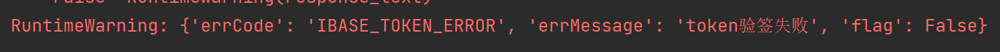
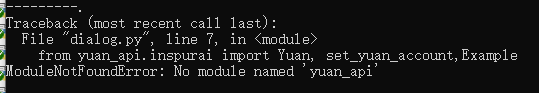
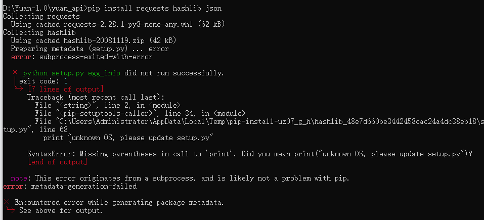

# 源1.0大模型开源开放FAQ  #

---

本文对源1.0使用过程中，常见的问题及解释进行了梳理，请各位开发者参考使用，如不能解决请邮件联系：[air_service@inspur.com](air_service@inspur.com)。

---

1. __Q__：源1.0 API是如何收费的？

   __A__：API服务一直是免费申请的，目前没有收费计划。

2. __Q__：源1.0服务的响应时间有时候不尽如人意，怎么解决？

   __A__：我们正在协调更多的服务器，提供更稳定的API服务，同时支持更多客户，响应时间也会得到优化。

3. __Q__：源1.0支持本地化部署（私有化部署）吗？

   __A__：支持本地化部署（私有化部署），如果自有配套硬件环境的话，可以通过与浪潮签署针对源1.0模型套件（推理服务）的POC（Proof of Concept）合作协议，免费试用3个月。试用满意后，可联系购买源1.0模型套件。

4. __Q__：如何进行模型在自有数据上的微调？微调模型是需要收费的是吗？

   __A__：目前还不支持在线调用API进行微调。您可以向源大模型官方提供数据，经过查验数据质量可用的话，由源大模型官方来进行微调训练得到微调后的模型，微调模型会更加适合不同垂直领域场景下的特定业务。微调的模型同样支持在线API服务和本地化部署。微调模型属于定制化服务，具体收费以双方商定为准，详询源大模型小助理。

5. __Q__：Github示例代码中add_example有没有容量限制，似乎加到一定程度之后就会报错。

   __A__：输入模型的总tokens长度（example包含在内的prompt长度）不可以超过2048tokens。

6. __Q__：代码提示“验签失败”。

   

   __A__:

   1） 首先，查看自己的使用权限，源1.0提供时限3个月，总次数3万次的免费权限。

   2） 使用权限正常的话，请查看自己是否正确的输入了**用户名**和**手机号**。

   3） 以上都排除的话，请查看使用API服务的设备时间是否是正确的北京时间。

如以上方法不能解决，请详询大模型小助理。

7. __Q__：使用API代码显示无法找到yuan_api。

   

   __A__：引用的库层次不对，可在yuan_api同级目录，使用相对路径调用目标代码，即可导入yuan_api库。

8. __Q__：安装hashlib库的时候，报错--

   

   __A__：在pip list中查看是否已经安装了对应库，如果当前已经安装了对应库，就跳过该库的安装。后期可以正常使用源1.0 API服务。

